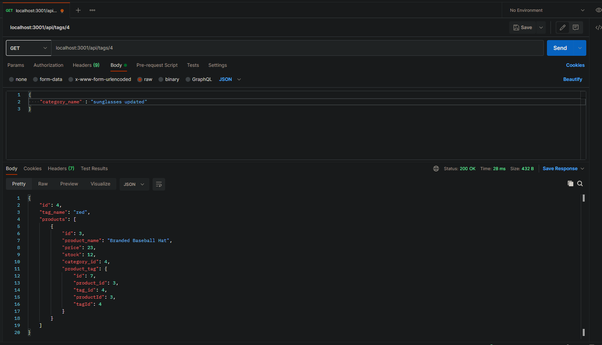

# e-commerce_back_end
Object-Relational Mapping (ORM): E-Commerce Back End

  ## Description
  Create an ecommerce backend system for manipulating databases. This is for users who want to view, update and delete their products in their online stores. 

  * [Installation](#installation)
  * [Technology](#technology)
  * [Success](#success)
  * [Holdbacks](#holdbacks)
  * [Contribution](#contribution)
  * [Test](#test)
  * [License](#license)
  * [Questions](#questions)
  

## Installation
npm run seed and npm start in terminal. Also need to install express, sequalize and MYSQL2. Lastly the database will need to be created in mysql workbench

## Technology
Express.js, sequalize, MYSQL2, MYSQL workbench, POSTMAN

## Success
I had a great time with this project. It looked alot harder than it ended up being which was a nice suprise. I got my models done very quickly and then started on the routes. I got through the get, get all and delete routes fairly easily. The others took some time but in the end, once one route folder was completed, it was pretty much copy and paste into the others and making the relevant adjustments. 

## Holdbacks
Code wise, I didnt struggle as much on this one as I have with previous ones. It was alot of new concepts but i found the class assignments and working with class mates made it quite a simple process. My major issues came with using postman to be honest. IVe only had a little exposure to it and practicing with it was a little more time consuming then i wanted. So it took me longer to test my code. 

## Contribution
We were given alot of code to start off with. We had to create the models, the routes and make sure all the relevant add ons were installed. With a little troubleshooting with the tutor and solving a problem or 2 with my study group, I was able to write the majority of the code by myself with some small tweaks from outside help and research. 

## Test
no testing 

## License 

## Questions
If you have fursther questions, you can reach me at
[Github](https://github.com/Jarred-Caris)
or
jarred.caris@gmail.com

[click for video] (https://drive.google.com/file/d/1FGKL9BO5TSSME4vQabOq0SZzxckqyJW5/view)

[click for URL] (https://jarred-caris.github.io/note_taker/)
